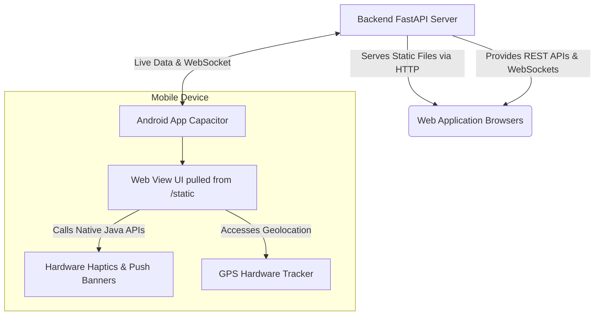

<div align="center">
  

  <h1>SCOS: Smart Waste Collection Optimization System</h1>
  <p><b>An Enterprise-Grade, Cross-Platform Municipal Waste Management Solution</b></p>

  <p>
    <a href="https://scos-app.onrender.com">Live Web Platform</a> • 
    <a href="#mobile-app-architecture">Mobile Android App</a> • 
    <a href="#architecture--system-flow">System Architecture</a>
  </p>
</div>

---

##  Overview
Smart Waste Collection Optimization System (SCOS) is a full-stack, AI & IoT-powered municipal waste management platform. It gamifies citizen reporting and automates municipal driver logistics into a unified, real-time ecosystem.

What makes SCOS technically unique is its **Hybrid Architecture**: We built a single, responsive Web Application that simultaneously powers a fully native Android application using **Capacitor**. Both platforms communicate seamlessly via WebSockets for instant push notifications and real-time GPS tracking.

---

##  Architecture & System Flow

SCOS utilizes a highly decoupled, real-time architecture built to scale horizontally. The system comprises three main layers:

### 1. High-Performance Asynchronous Backend (`/backend`)
Our core API acts as the central brain, bridging Web and Mobile users.
- **Framework:** Python FastAPI serving high-concurrency async REST and WebSocket APIs.
- **Database Engine:** Async SQLAlchemy ORM connected to SQLite (Development) or PostgreSQL (Production).
- **Security:** Stateless JSON Web Tokens (JWT) for robust Role-Based Access Control (RBAC).
- **Real-Time Engine:** A dedicated `ConnectionManager` pushing live updates directly to active users.

### 2. Unified Frontend Platform (`/backend/static`)
Instead of duplicating effort across iOS, Android, and Web, we created a single frontend that adapts to its host device.
- **Technologies:** Vanilla JavaScript, HTML5, and TailwindCSS integrated with modern Glassmorphism UI principles.
- **Adaptive Routing:** The frontend dynamically sniffs its environment (`window.Capacitor.isNativePlatform()`). If running on the web, it behaves like a standard SPA. If running on mobile, it hardware-accelerates UI elements (like the Android back button) and overrides local URLs to point to the production cloud.

### 3. Native Mobile Wrapper (`/mobile`)
This directory contains the Android/iOS compile targets powered by **Ionic Capacitor**. 
- Capacitor injects native SDKs into our web view.
- When the backend broadcasts a `NEW_TASK` over WebSockets, the JavaScript layer catches it and triggers **Native Push Notifications** (`@capacitor/local-notifications`) and **Hardware Haptics/Vibration** (`@capacitor/haptics`) in the driver's pocket.

---

##  How the Web and Mobile Apps Interlink

SCOS solves the "Double Codebase" problem through an elegant hybrid approach. Here is the operational flow of how the Web UI and Mobile App share the same lifecycle:



**The Interlinked Workflow:**
1. **Citizen (Web/Mobile):** A citizen logs in (on phone or desktop), geolocates a pile of illegal waste, and snaps a photo. They earn *EcoPoints* via the gamified rewards store.
2. **Backend Engine:** FastAPI processes the image, saves the coordinate, and runs an algorithmic dispatch to find the nearest available driver.
3. **Driver (Mobile App):** 
   - The driver is roaming the city with the Android app open.
   - The backend pushes a silent WebSocket event to the driver's specific connection pool.
   - The app's JavaScript catches the payload and fires a **native vibration and banner drop-down** using Capacitor's injected bridges.
   - The driver's map updates with turn-by-turn routing to the incident.
4. **Admin Command Center (Web):** The municipal admin watches all of this happen in real-time via the live Geospatial Heatmaps on their desktop.

---

##  Repository Structure

The repository follows an enterprise monorepo structure:

```text
SCOS-App/
├── backend/                   # Python FastAPI Application
│   ├── app/                   # Core App Logic
│   │   ├── api/v1/            # REST API endpoints (Admin, Auth, Citizen, Driver)
│   │   ├── core/              # Security and Auth utilities
│   │   ├── db/                # SQLAlchemy models and engine configuration
│   │   ├── repositories/      # Database abstraction layer (CRUD operations)
│   │   └── websocket/         # Real-time ConnectionManager 
│   ├── static/                # Hybrid Frontend Code (HTML/CSS/JS)
│   ├── tests/                 # 100% API coverage using pytest-asyncio
│   ├── main.py                # Server Entrypoint
│   └── requirements.txt       # Python dependencies
├── mobile/                    # Capacitor Mobile Wrapper
│   ├── android/               # Compiled Android Studio Project
│   └── capacitor.config.ts    # Links native app to the /backend/static UI
├── .github/workflows/         # CI/CD Pipeline Definitions
└── docker-compose.yml         # Containerization infrastructure
```

---

##  Quick Start & Deployment

### 1. Local Development (Backend + Web)
```bash
# Clone the repository
git clone https://github.com/PRAHULREDD/SCOS-App.git
cd SCOS-App/backend

# Initialize Virtual Environment
python -m venv venv
source venv/bin/activate  # Windows: venv\Scripts\activate

# Install Dependencies and Run PyTest Validation
pip install -r requirements.txt
python -m pytest

# Run Local Server
python -m uvicorn main:app --reload --host 127.0.0.1 --port 8000
```
*The auto-seeder will immediately provision your local database with mock data. Access the web platform at http://127.0.0.1:8000/.*

### 2. Android Mobile Build
Because the mobile app uses the exact same frontend as the web app, building the `.apk` is simple:
```bash
cd mobile
npm install
npx cap sync android
npx cap open android
```
*(Requires Android Studio to compile the final `.apk`)*

### 3. Cloud Deployment (Render)
SCOS is natively optimized for cloud platforms like Render:
- Connect this repository to Render.
- Select **Web Service** → Build and deploy from Git repository.
- Set the Root Directory to `backend`. 
- **Zero-Latency Note:** SCOS utilizes an integrated `/health` ping-service loop via `cron-job.org` to ensure absolute zero-latency cold-starts for our mobile users, bypassing standard free-tier hibernation constraints.

---

##  Testing & CI/CD
SCOS maintains a strict CI/CD pipeline via GitHub Actions. **100% of our API endpoints are covered by production-grade async integration tests.** Pushing to the `main` branch will automatically trigger `flake8` linting and `pytest` validation. Deployments to Render are blocked until the CI pipeline reports total success.

---

##  License & Contributing
See [CONTRIBUTING.md](CONTRIBUTING.md) for pull request guidelines.  
Licensed under the MIT License - see [LICENSE](LICENSE) for details.
