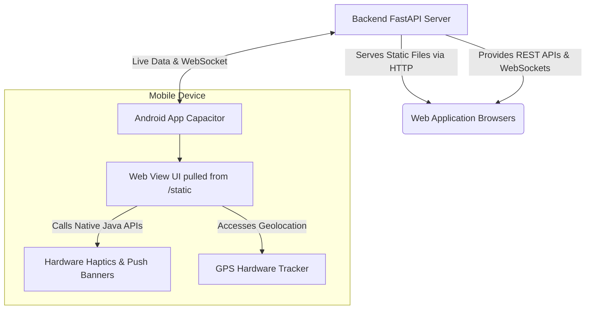

<div align="center">
  

  <h1>SCOS: Smart Waste Collection Optimization System</h1>
  <p><b>A full-stack, cross-platform municipal waste management project</b></p>

  <p>
    <a href="https://scos-app.onrender.com">Live Web Platform</a> • 
    <a href="#mobile-app-architecture">Mobile Android App</a> • 
    <a href="#architecture--system-flow">System Architecture</a>
  </p>

  <br/>
  <a href="https://github.com/PRAHULREDD/SCOS-App/releases/tag/v1.0.0">
    
  </a>
</div>

---

##  Overview
Smart Waste Collection Optimization System (SCOS) is a full-stack municipal waste management project. It gamifies citizen reporting and manages municipal driver logistics.

The main goal was to build a **Hybrid Architecture**: I created a single, responsive Web Application that simultaneously powers a fully native Android application using **Capacitor**. Both platforms communicate seamlessly via WebSockets for instant push notifications and real-time GPS tracking.

---

##  Architecture & System Flow

The architecture comprises three main layers:

### 1. FastAPI Backend (`/backend`)
Our core API acts as the central brain, bridging Web and Mobile users.
- **Framework:** Python FastAPI serving async REST and WebSocket APIs.
- **Database Engine:** Async SQLAlchemy ORM connected to SQLite (Development) or PostgreSQL (Production).
- **Security:** Stateless JSON Web Tokens (JWT) for robust Role-Based Access Control (RBAC).
- **Real-Time Engine:** A dedicated `ConnectionManager` pushing live updates directly to active users.

### 2. Unified Frontend Platform (`/backend/static`)
Instead of duplicating effort across iOS, Android, and Web, we created a single frontend that adapts to its host device.
- **Technologies:** Vanilla JavaScript, HTML5, and TailwindCSS using standard HTML/CSS patterns.
- **Adaptive Routing:** The frontend dynamically sniffs its environment (`window.Capacitor.isNativePlatform()`). If running on the web, it behaves like a standard SPA. If running on mobile, it adapts to Capacitor features (like the Android back button) and overrides local URLs to point to the production cloud.

### 3. Native Mobile Wrapper (`/mobile`)
This directory contains the Android/iOS compile targets powered by **Ionic Capacitor**. 
- Capacitor injects native SDKs into our web view.
- When the backend broadcasts a `NEW_TASK` over WebSockets, the JavaScript layer catches it and triggers **Native Push Notifications** (`@capacitor/local-notifications`) and **Hardware Haptics/Vibration** (`@capacitor/haptics`) in the driver's pocket.

---

##  How the Web and Mobile Apps Interlink

SCOS solves the "Double Codebase" problem through an elegant hybrid approach. Here is the operational flow of how the Web UI and Mobile App share the same lifecycle:


```mermaid
graph TD
    A[Backend FastAPI Server] -->|Serves Static Files via HTTP| B(Web Application Browsers)
    A -->|Provides REST APIs & WebSockets| B
    A <-->|Live Data & WebSocket| C[Android App Capacitor]
    
    subgraph Mobile Device
    C --> D[Web View UI pulled from /static]
    D -->|Calls Native Java APIs| E[Hardware Haptics & Push Banners]
    D -->|Accesses Geolocation| F[GPS Hardware Tracker]
    end
```

**The Interlinked Workflow:**
1. **Citizen (Web/Mobile):** A citizen logs in (on phone or desktop), geolocates a pile of illegal waste, and submits a waste report. They earn *EcoPoints* via the gamified rewards store.
2. **Backend Engine & Admin:** FastAPI saves the coordinates and report data. The Municipal Admin then reviews the incident and manually assigns an available driver via the Command Center interface.
3. **Driver (Mobile App):** 
   - The driver is roaming the city with the Android app open.
   - The backend pushes a silent WebSocket event to the driver's specific connection pool.
   - The app's JavaScript catches the payload and fires a **native vibration and banner drop-down** using Capacitor's injected bridges.
   - The driver's map updates with the incident location.
4. **Admin Command Center (Web):** The municipal admin monitors complaints and assigns tasks in real-time. (Note: The current implementation features a static visual representation of the heatmap UI, while the backend API provides real coordinate data for future dynamic plotting).

---

##  Repository Structure

The repository structure:

```text
SCOS-App/
├── backend/                   # Python FastAPI Application
│   ├── app/                   # Core App Logic
│   │   ├── api/v1/            # REST API endpoints (Admin, Auth, Citizen, Driver)
│   │   ├── core/              # Security and Auth utilities
│   │   ├── db/                # SQLAlchemy models and engine configuration
│   │   ├── repositories/      # Database abstraction layer (CRUD operations)
│   │   └── websocket/         # Real-time ConnectionManager 
│   ├── static/                # Hybrid Frontend Code (HTML/CSS/JS)
│   ├── tests/                 # API tests using pytest-asyncio
│   ├── main.py                # Server Entrypoint
│   └── requirements.txt       # Python dependencies
├── mobile/                    # Capacitor Mobile Wrapper
│   ├── android/               # Compiled Android Studio Project
│   └── capacitor.config.ts    # Links native app to the /backend/static UI
├── .github/workflows/         # CI/CD Pipeline Definitions
└── docker-compose.yml         # Containerization infrastructure
```

---

##  Quick Start & Deployment

### 1. Local Development (Backend + Web)
```bash
# Clone the repository
git clone https://github.com/PRAHULREDD/SCOS-App.git
cd SCOS-App/backend

# Initialize Virtual Environment
python -m venv venv
source venv/bin/activate  # Windows: venv\Scripts\activate

# Install Dependencies and Run PyTest Validation
pip install -r requirements.txt
python -m pytest

# Run Local Server
python -m uvicorn main:app --reload --host 127.0.0.1 --port 8000
```
*Access the web platform at http://127.0.0.1:8000/.*

### 2. Android Mobile Build
Because the mobile app uses the exact same frontend as the web app, building the `.apk` is simple:
```bash
cd mobile
npm install
npx cap sync android
npx cap open android
```
*(Requires Android Studio to compile the final `.apk`)*

### 3. Cloud Deployment (Render)
SCOS is natively optimized for cloud platforms like Render:
- Connect this repository to Render.
- Select **Web Service** → Build and deploy from Git repository.
- Set the Root Directory to `backend`. 


---

## Future Scope
- **Live Geospatial Heatmaps**: Implementing dynamic heatmap plotting on the Admin dashboard using the existing backend coordinate data.
- **Algorithmic Dispatch**: Automating driver assignments based on proximity and load instead of manual admin assignment.
- **Image Processing**: Supporting rich media uploads for citizen waste reports.

---

## Testing & CI/CD
The project includes a `pytest` suite for automated backend testing, and a GitHub Actions workflow for CI. Pushing to the `main` branch triggers `flake8` linting and `pytest` validation.

---

##  License & Contributing
See [CONTRIBUTING.md](CONTRIBUTING.md) for pull request guidelines.  
Licensed under the MIT License - see [LICENSE](LICENSE) for details.


